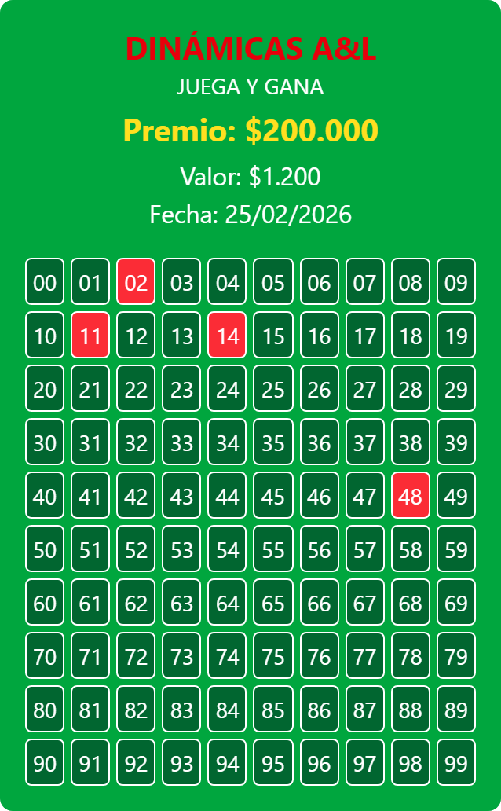

<div align="center">
<h1> 🎟️ Gestor de Lotería - Dinámicas A&L </h1>

<p>Aplicación web desarrollada en <strong>React</strong> y <strong>Tailwind</strong> CSS para la gestión eficiente de sorteos de 100 números (00-99). Permite administrar ventas, visualizar disponibilidad y generar flyers publicitarios automáticos para compartir en redes sociales o WhatsApp.</p>
</div>

<!-- <hr/> -->

<div align="center">
<h1> 📸 Vista Previa </h1>

<p class="text-black text-opacity-50">Cáptura de Flyer</p>
</div>


##


## 🚀 Características Principales
- **Control de Inventario:** Gestión visual de los 100 cupos disponibles.
- **Configuración Dinámica:** Personalización de premios, valor del ticket y fecha del sorteo desde la interfaz.
- **Generación de Imagen:** Exportación automática del estado del sorteo en formato de imagen.
- **Persistencia de Datos:** Uso de `localStorage` para mantener el estado de las ventas sin necesidad de base de datos externa.
- **Responsive Design:** Interfaz optimizada mediante Tailwind CSS.

## 🛠️ Stack Tecnológico
* **Frontend:** [ReactJS](https://reactjs.org/)
* **Estilos:** [Tailwind CSS](https://tailwindcss.com/)
* **Almacenamiento:** LocalStorage API
* **Utilidades:** html-to-image (generar imagen) / sweetalert2 (mensajes al usuario).

## 📥 Instalación y Puesta en Marcha

Sigue estos pasos para ejecutar el proyecto en tu entorno local:


1. Clonar el repositorio

```bash
git clone https://github.com/esierradev/loteria-react-tailwind-localstorage.git
```

2. Navegar al directorio

```bash
cd loteria-react-tailwind-localstorage
```

3. Instalar dependencias (teniendo instalado Node.js)

```bash
npm install
```

4. Iniciar el servidor de desarrollo

```bash
npm run dev
```

5. Abre en tu navegador

```bash
http://localhost:5173 en tu navegador para ver la aplicación funcionando.
```
<br/>

<div align="center">
<p>
⚠️ Nota Importante
Al utilizar localStorage, la información de los números marcados como "vendidos" reside exclusivamente en el navegador local. Limpiar el caché o cambiar de navegador reseteará el estado de la lotería.
</p>

<br/>

<h3>Proyecto Desplegado: <a href="https://gestor-loteria.netlify.app/">https://gestor-loteria.netlify.app/</a></h3>

<h4>Desarrollado con 💪 por <strong>Emmanuel Sierra</strong></h4>

</div>